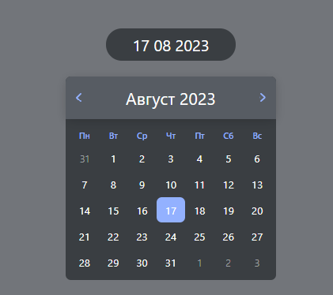

# calendar

Календарь веб-приложение - это онлайн инструмент, который помогает пользователям управлять своим временем и планировать события.

## Демо



## Технологии

<table width='100%'>
  <tr>
    <td align="center" width="110" height="90">
      
      <br>Typescript
   </td>
   <td align="center" width="110" height="90">
      
      <br>React JS
    </td>
  </tr> 
</table>

## Запуск проекта

Для запуска проекта необходимо выполнить следующие действия:

1. Склонировать проект на ваш компьютер с [Github](https://github.com/Hem1x/calendar) с помощью команды:

```
git clone git@github.com:Hem1x/calendar.git
```

2. Установить зависимости:

```
npm install
```

3. Запустить проект:

```
npm start
```

## Ссылка на проект

https://calendar-hem1x.vercel.app/
